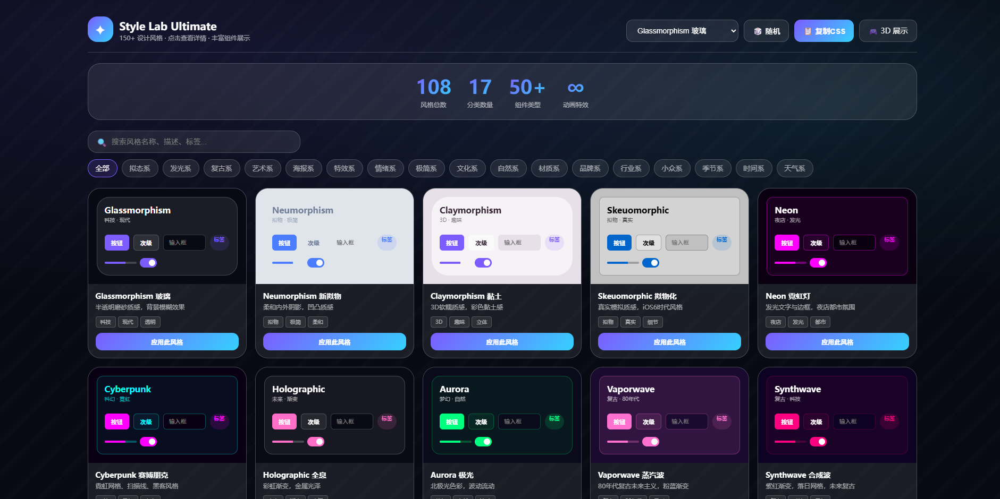
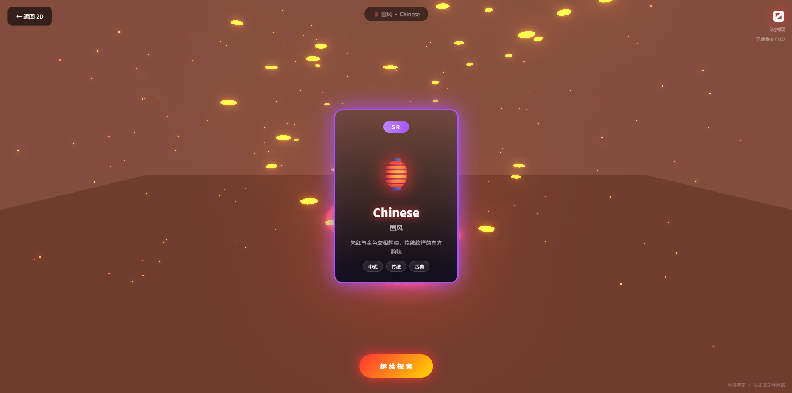
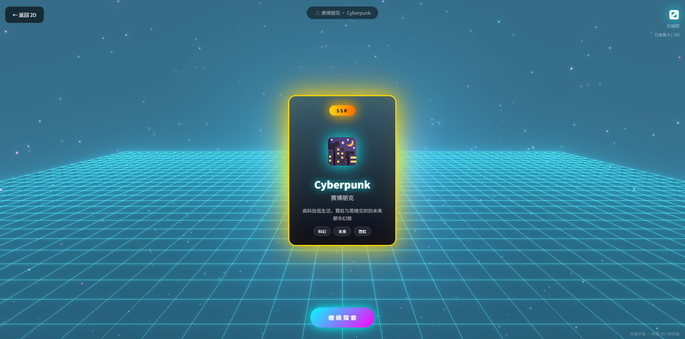

# Style Universe · 风格宇宙

**150+ 设计风格全景库** — 集 2D 展示、3D 抽卡体验、后台管理于一体的交互式设计风格百科。

探索从玻璃拟态到赛博朋克，从和风侘寂到蒸汽波，涵盖 17 大类、100+ 种设计风格的视觉体验。

## Preview

### 2D 风格库

108 种风格卡片，实时预览配色、组件、动画效果，支持分类筛选与搜索。



### 3D 抽卡体验

Three.js 驱动的沉浸式 3D 空间，每种风格拥有独特的艺术装置、Shader 材质与粒子效果。





## Features

### 2D Style Lab (`index.html`)
- **150+ 设计风格**，覆盖拟态系、发光系、复古系、艺术系、文化系等 17 大类
- 分类标签筛选、关键词搜索、随机切换
- 点击详情查看 UI 组件预览、交互组件演示、代码片段
- 一键导出 CSS / SCSS / Tailwind / Figma / JSON 配置

### 3D Gacha (`3d.html`)
- **Three.js** 驱动的 3D 沉浸式抽卡空间
- **82 种风格**各有独特 3D 艺术装置（樱花树、齿轮组、水母群、金字塔、霓虹光管...）
- **10 种自定义 GLSL Shader**：流体变形、脉冲发光、极光帘幕、全息彩虹、故障失真、水面波纹、火焰能量、水墨晕染、晶体矿石、代码矩阵
- **SSR / SR / R / N** 四级稀有度系统，加权随机抽取
- 3D 卡牌翻转动画、相机运镜（推近→揭示→环绕）、场景过渡动画
- 风格色自适应背景、收藏历史、URL 直链预览

### Admin Panel (`admin.html`)
- 全部风格的可视化管理面板
- 按稀有度 / 标签筛选排序，网格 / 列表双视图
- 配色方案预览 + CSS Token 一键复制
- 直跳 3D 预览

## Tech Stack

| 技术 | 用途 |
|------|------|
| **Three.js** r160 | 3D 场景渲染 |
| **GLSL** | 自定义 Shader 材质 |
| **UnrealBloomPass** | 后处理辉光效果 |
| **Vanilla HTML/CSS/JS** | 零依赖，无需构建工具 |

## Getting Started

### 在线访问

直接打开 GitHub Pages 即可体验。

### 本地运行

```bash
# 克隆仓库
git clone https://github.com/RealityError/style-universe.git
cd style-universe

# 用本地服务器运行（3D 页面需要 ES Module 支持）
npx serve .
# 或者
python -m http.server 8080
```

然后访问 `http://localhost:8080`

## Style Collection

| 稀有度 | 概率 | 示例 |
|--------|------|------|
| **SSR** | 3% | 玻璃拟态、霓虹、赛博朋克、极光、和风、哥特、全息、故障艺术、阈限空间、怪核 |
| **SR** | 15% | 蒸汽波、像素风、国风、海洋、蒸汽朋克、可爱粉彩、装饰艺术、暗黑学院、梦核... |
| **R** | 45% | 日落、冬天、森林、渐变、禅意、午夜、GitHub、Spotify、希腊风、婚礼... |
| **N** | 37% | 沙漠、自然、纸质、木质、医疗、教育、晴天、雾天、无印风... |

## About

Style Universe 是一个设计风格的交互式百科全书。

这个项目的目的是帮助设计师和开发者快速浏览、对比、选择适合自己项目的设计风格。无论你是在寻找 App 的视觉方向，还是想了解某种设计流派的配色与特征，都可以在这里找到答案。

**为什么做这个项目？**

- 市面上的设计风格参考大多是静态图片，缺乏交互性
- 想用一种有趣的方式（抽卡）来探索不同风格，而不是枯燥地翻列表
- 每种风格都有自己的"灵魂"，用 3D 空间 + Shader 来表达比平面截图更有感染力

**项目特色**

- 纯前端实现，零后端依赖，一个 HTML 文件即是一个完整应用
- 自定义 GLSL Shader 为每种风格赋予独特的视觉质感
- 覆盖从主流（iOS、Material）到小众（怪核、阈限空间、Frutiger Aero）的广泛风格谱系

## License

[GPL-3.0](LICENSE)
